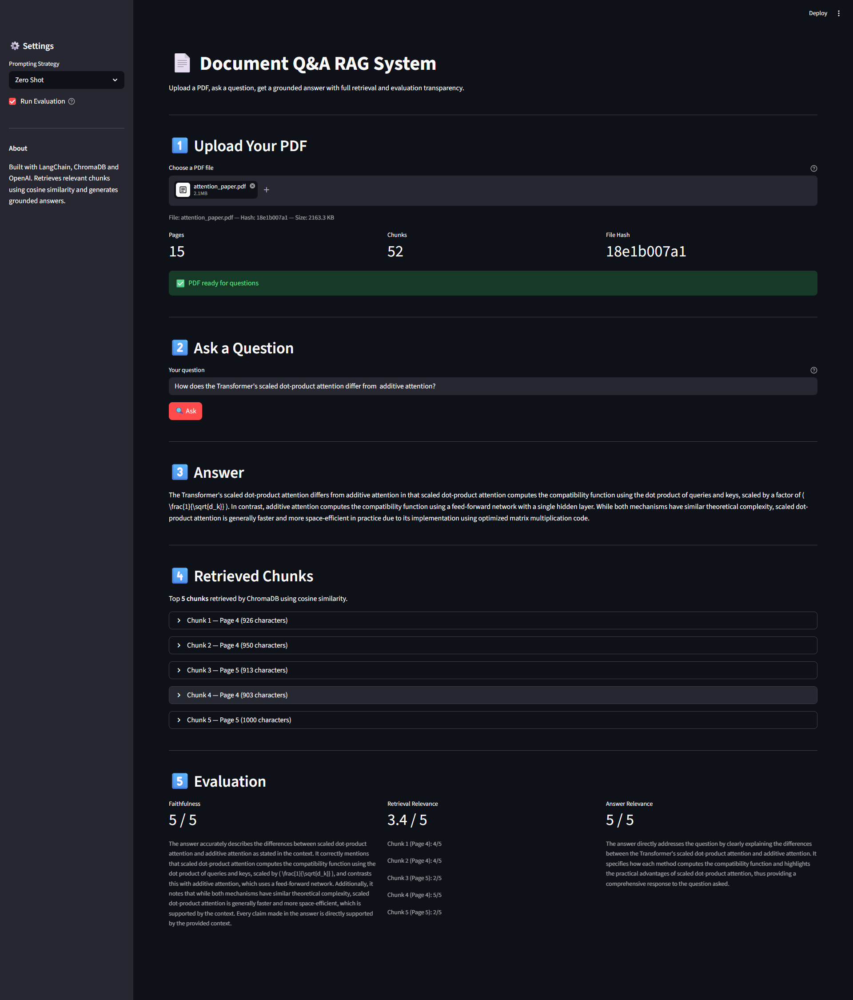

#  Document Q&A RAG Pipeline

A production-style Retrieval-Augmented Generation (RAG) system that answers questions about PDF documents with full retrieval transparency and automated evaluation.

Built as a learning project to deeply understand RAG architecture, embeddings, vector databases, and prompt engineering.

---

##  Architecture
```
  PDF → Text Extraction → Chunking → Embeddings → ChromaDB
                                                        ↓
User Query → Embed Query → Cosine Similarity Search → Top 5 Chunks
                                                        ↓
                                 Augmented Prompt → GPT-4o-mini → Answer
                                                                    ↓
                                                   Faithfulness + Relevance Evaluation
   ```

---
##  Demo



---

##  Features

- **PDF Ingestion** : Extracts text from any text-based PDF using LangChain
- **Intelligent Chunking** : Splits text with overlap to preserve context boundaries
- **Semantic Embeddings** : Converts chunks to 1536-dimension vectors using OpenAI
- **Vector Storage** : Stores and retrieves embeddings using ChromaDB locally
- **Smart Caching** : Document fingerprinting prevents duplicate API calls
- **Three Prompting Strategies** : Compare Zero-shot, Few-shot, and Chain-of-Thought
- **Automated Evaluation** : LLM-as-a-judge scoring for faithfulness, retrieval relevance, and answer relevance
- **Interactive UI** : Clean Streamlit dashboard with expandable chunk viewer

---

##  Tech Stack

| Tool | Purpose |
|------|---------|
| **LangChain** | Document loading, chunking, retrieval orchestration |
| **ChromaDB** | Local vector database with HNSW indexing |
| **OpenAI API** | Embeddings (text-embedding-3-small) + Generation (gpt-4o-mini) |
| **Streamlit** | Interactive web UI |
| **PyPDF** | PDF text extraction |

---

## 📁 Project Structure

```
doc-qa-rag/
├── data/                  # Input PDF files
├── src/
│   ├── config.py          # Central settings and API key loading
│   ├── ingestion.py       # PDF loading and inspection
│   ├── chunking.py        # Text splitting with overlap
│   ├── embeddings.py      # OpenAI embedding model setup
│   ├── vectorstore.py     # ChromaDB build, load, and smart caching
│   ├── retriever.py       # Semantic chunk retrieval
│   ├── prompts.py         # Zero-shot, few-shot, chain-of-thought prompts
│   ├── generation.py      # LLM answer generation
│   └── evaluation.py      # Faithfulness and relevance scoring
├── app.py                 # Streamlit UI
├── main.py                # CLI pipeline entry point
├── requirements.txt
└── .env.example
```

---

##  Setup

1. **Clone the repository**
```bash
   git clone https://github.com/DhawalR/doc-qa-rag
   cd doc-qa-rag
```

2. **Create and activate virtual environment**
```bash
   python -m venv venv
   source venv/Scripts/activate  # Windows
   source venv/bin/activate      # Mac/Linux
```

3. **Install dependencies**
```bash
   pip install -r requirements.txt
```

4. **Add your OpenAI API key**
```bash
   cp .env.example .env
   # Open .env and add your key
```

5. **Run the UI**
```bash
   streamlit run app.py
```

6. **Or run the CLI pipeline**
```bash
   python main.py
```

---

##  How It Works

### Indexing Phase (done once per document)
1. PDF text is extracted page by page
2. Text is split into overlapping chunks of 1000 characters
3. Each chunk is converted to a 1536-dimension embedding vector
4. Vectors are stored in ChromaDB with metadata (page number, source)

### Query Phase (every question)
1. Question is converted to an embedding vector
2. ChromaDB finds top 5 chunks by cosine similarity
3. Chunks are injected into an augmented prompt
4. GPT-4o-mini generates a grounded answer
5. LLM-as-a-judge evaluates faithfulness and relevance

---

##  Known Limitations

- Mathematical formulas in PDFs may not extract correctly due to limitations of text-based PDF parsing. Tools like Nougat or MathPix handle this better for academic papers.
- Scanned PDFs (image-based) are not supported - text-based PDFs only.
- All embeddings are stored in a single ChromaDB collection. Multi-document management is a planned improvement.

---

## 📊 Evaluation Metrics

| Metric | What it measures |
|--------|-----------------|
| **Faithfulness** | Are all claims in the answer supported by retrieved chunks? |
| **Retrieval Relevance** | Did ChromaDB retrieve chunks relevant to the question? |
| **Answer Relevance** | Does the answer actually address what was asked? |

Scoring uses LLM-as-a-judge on a 1-5 scale with full reasoning.

---

##  Bullet Points

- Built end-to-end RAG pipeline using LangChain, ChromaDB, and OpenAI with semantic chunking, cosine similarity retrieval, and automated hallucination evaluation
- Implemented document fingerprinting to prevent duplicate embedding API calls across sessions
- Compared zero-shot, few-shot, and chain-of-thought prompting strategies with quantitative LLM-as-a-judge evaluation

---
---

##  Upcoming: AWS Cloud Deployment

The project is currently running locally, with plans to deploy it to **AWS** in the near future — using only **Always Free** tier services that do not expire and cost nothing within their monthly limits:

- **AWS Lambda** : Run the embedding and retrieval pipeline as serverless functions — free for up to 1 million requests/month, always
- **Amazon S3** : Store PDF documents in the cloud — free for up to 20,000 GET and 2,000 PUT requests/month, always
- **Amazon DynamoDB** : Persist document metadata and session state — free for up to 25 GB storage and 200 million requests/month, always
- **Amazon CloudWatch** : Monitor pipeline performance and errors — free for up to 10 custom metrics and 10 alarms, always
<!-->  All services listed above fall under AWS's **Always Free** tier, meaning they remain free indefinitely as long as usage stays within the monthly limits. No credit card charges expected for a project of this scale. -->


---

Built by Dhawal - NITK
